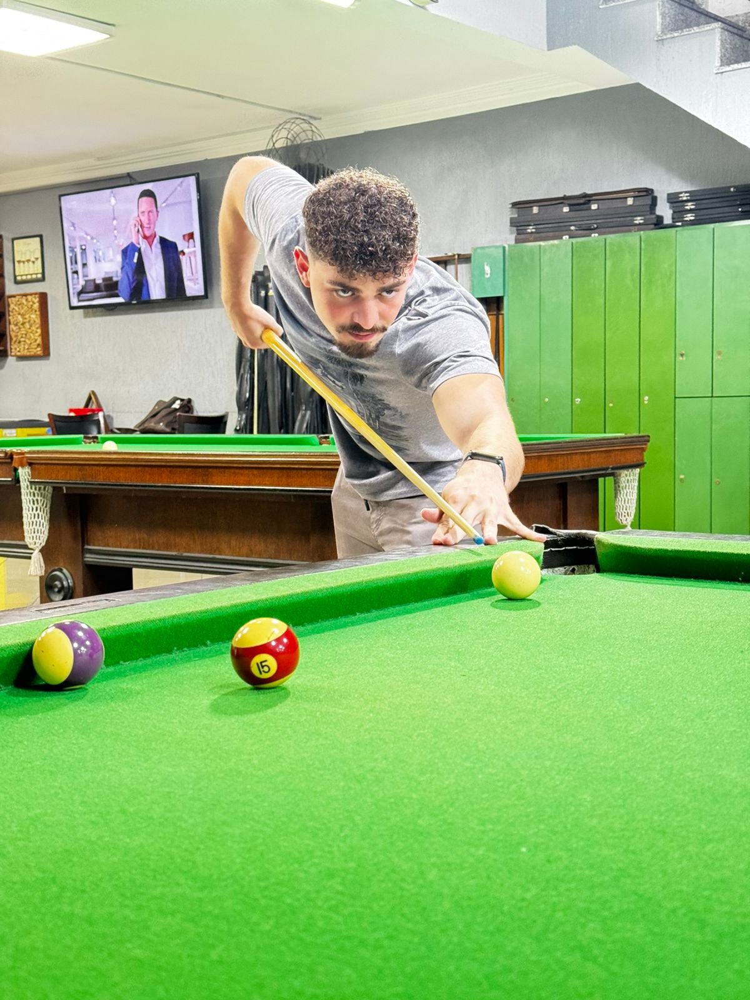

> ## Bem Vindo(a) ao repositório oficial da PostUp!
> ### Aqui você vai encontrar
> 1. Título e Descrição do Projeto
> 2. Tecnologias
> 3. Estrutura de Pastas
> 4. Credenciáis
> 5. Representação do Projeto
> 6. Link do Repositório
> 7. Contato
> ---
> ### 1. Título e Descrição
> - Somos a **PostUp** e em união com a empresa parceira **SoulUp** temos a tarefa de solucionar o **Desafio 01** proposto pela empresa. 
> - Nosso principal dever é desenvolver um sistema que possibilite o usuário fazer postagens sustentáveis e acumular de 0 a 100 pontos ECOA por meio de um score dinâmico calculado por um algoritmo próprio. Além disso, nosso sistema deve implementar um ranking mensal comparando usuários, e ao final do mês o vencedor terá sua conta de luz quitada.
> - Para saber mais sobre as características exclusivas da PostUp como detalhes da solução e diferenciáis, acesse a pasta **document** deste repositório.
> ---
> ### 2. Tecnologias
> #### - **IA e ChatBot**
> </img>
> </img>
> #### - **Back-End**
> </img>
> </img>
> #### - **Front-End**
> </img>
> #### - **Banco de Dados**
> </img>
> </img>
> ---
> ### 3. Estrutura de Pastas
> - Pasta **DOCUMENT**
>   - Local onde se encontra a documentação do projeto em formato .tex
> - Pasta **DATABASE**
>   - Local onde se encontra os arquivos de modelagem de dados e código .sql
> - Pasta **BACK-END**
>   - Local onde se encontra pastas java e python
>   - Java: Código do projeto em Java
>   - Python: Código do projeto em Python
> - Pasta **FRONT-END**
>   - Local onde se encontra a identidade visual do projeto
>   - Separado em pastas: pages(HTML), css(Styles), js(Scripts) e img(Imagens)
> ---
> ### 4. Credenciais
> #### Giovanni Zorzetto Oliveira
> </img>
> 1. Turma 1TDSPH
> 2. RM569464
> 3. <https://www.linkedin.com/in/giovanni-zorzetto-oliveira-8375b9305>
> 4. <https://github.com/Gizetto61>
> 5. <gigiozetto@gmail.com>
> #### Felipe Lima de Oliveira
> </img>
> 1. Turma 1TDSPH
> 2. RMXXXXXX
> 3. <https://www.linkedin.com/in/felipe-lima-a4215832a/>
> 4. <https://github.com/felipelima2005>
> 5. <xxxxxxxxxx@gmail.com>
> #### Raphael Gomes Brito
> </img>
> 1. Turma 1TDSPH
> 2. RMXXXXXX
> 3. <https://www.linkedin.com/in/xxxxxxxxx>
> 4. <https://github.com/PhaelRGB>
> 5. <xxxxxxxxxx@gmail.com>
> ---
> ### 5. Representação do Projeto
> ---
> ### 6. Link do Repositório
> - <https://github.com/Challenge-Next-2026/PostUp>
> ---
> ### 7. Contato
> - <challengeCFGR.2026@gmail.com>
> - +55 (11) 94306-3646
> - +55 (11) 96993-7538
> - +55 (11) 94169-6111