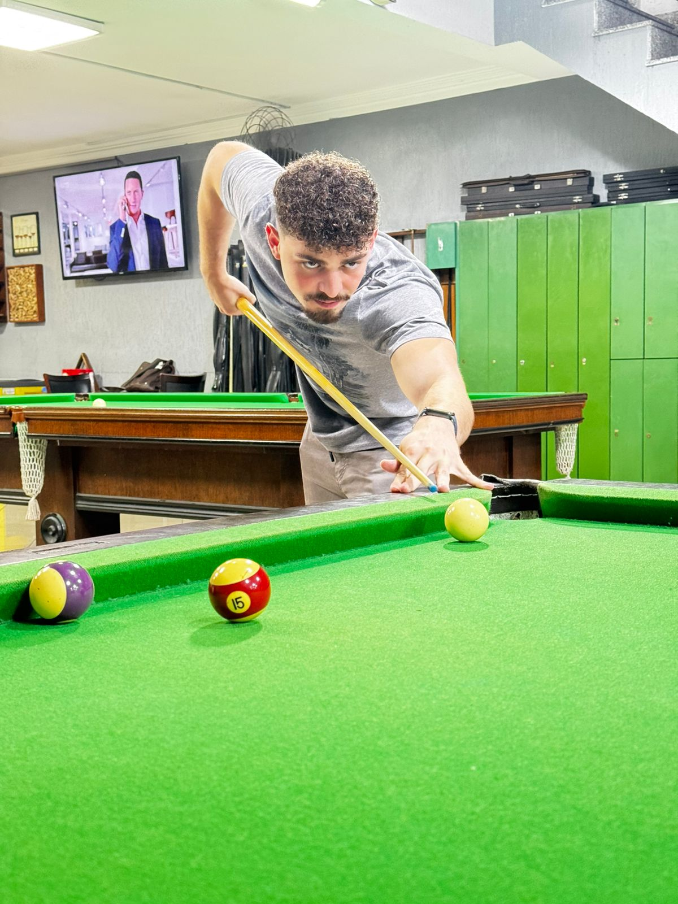
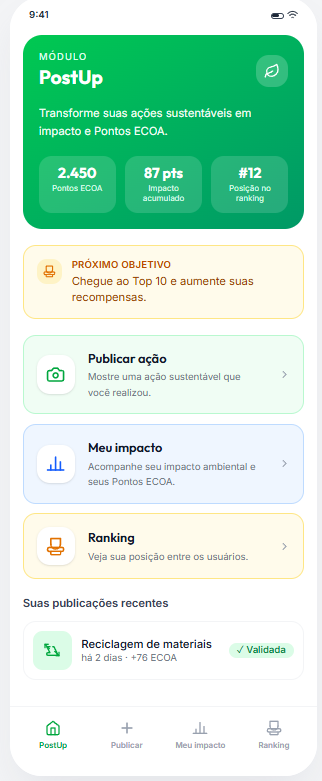
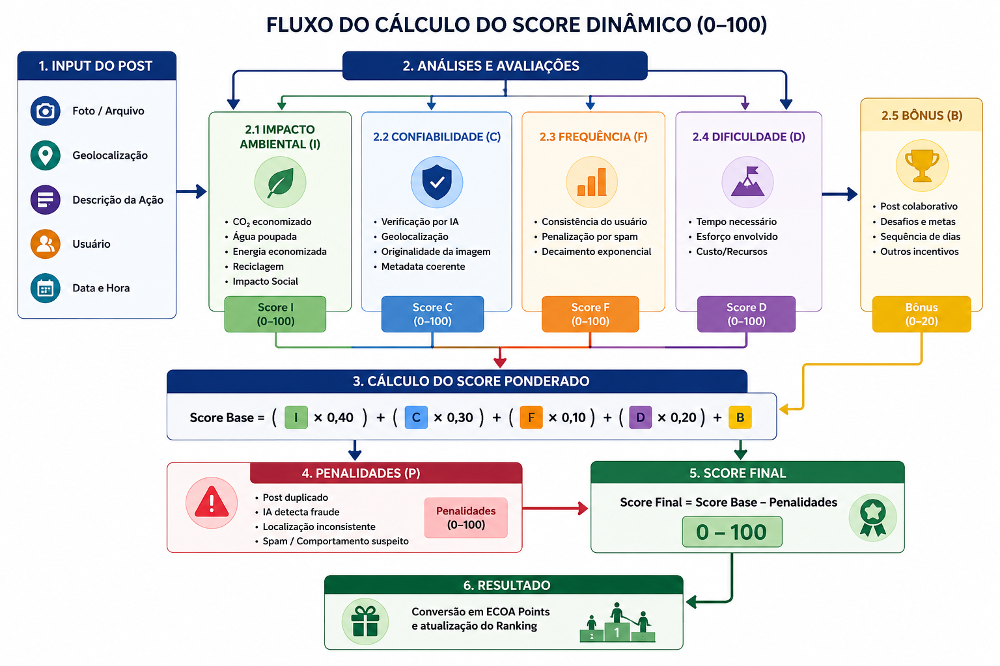

> ## Bem Vindo(a) ao repositório oficial da PostUp!
> ### Aqui você vai encontrar
> 1. Título e Descrição do Projeto
> 2. Tecnologias
> 3. Estrutura de Pastas
> 4. Credenciáis
> 5. Como executar localmente
> 6. Representação do Projeto
> 7. Pitch de Apresentação
> 8. Link do Repositório
> 9. Contato
> ---
> ### 1. Título e Descrição
> - Somos a **PostUp** e em união com a empresa parceira **SoulUp** temos a tarefa de solucionar o **Desafio 01** proposto pela empresa. 
> - Nosso principal dever é desenvolver um sistema que possibilite o usuário fazer postagens sustentáveis e acumular de 0 a 100 pontos ECOA por meio de um score dinâmico calculado por um algoritmo próprio. Além disso, nosso sistema deve implementar um ranking mensal comparando usuários, e ao final do mês o vencedor terá sua conta de luz quitada.
> - Para saber mais sobre as características exclusivas da PostUp como detalhes da solução e diferenciáis, acesse a pasta **document** deste repositório.
> ---
> ### 2. Tecnologias
> #### - **IA e ChatBot**
> </img>
> </img>
> #### - **Back-End**
> </img>
> </img>
> #### - **Front-End**
> </img>
> </img>
> </img>
> </img>
> #### - **Banco de Dados**
> </img>
> </img>
> ---
> ### 3. Estrutura de Pastas
> - Pasta **DOCUMENT**
>   - Local onde se encontra a documentação do projeto em formato .tex
> - Pasta **DATABASE**
>   - Local onde se encontra os arquivos de modelagem de dados e código .sql
> - Pasta **BACK-END**
>   - Local onde se encontra pastas java e python
>   - Java: Código do projeto em Java
>   - Python: Código do projeto em Python
> - Pasta **FRONT-END**
>   - Local onde se encontra a identidade visual do projeto
>   - Sprint 1 e 2
>     - Pastas: css(Styles), img(Imagens), js(JavaScript), paginas(HTML), arquivo index.html na raiz
>   - Sprint 3
>     - Pasta src -> Local onde se encontra o projeto idêntico ao da Sprint 1 e 2 migrado para o React, usando vite e Tailwind
> - Pasta **IA-CHATBOT**
>   - Local onde se encontra arquivos relacionados à base de dados em formato .xlxs para treinamento de agente
> ---
> ### 4. Credenciais
> #### Giovanni Zorzetto Oliveira
> </img>
> 1. Turma 1TDSPH
> 2. RM569464
> 3. <https://www.linkedin.com/in/giovanni-zorzetto-oliveira-8375b9305>
> 4. <https://github.com/Gizetto61>
> 5. <gigiozetto@gmail.com>
> #### Felipe Lima de Oliveira
> </img>
> 1. Turma 1TDSPH
> 2. RM569947
> 3. <https://www.linkedin.com/in/felipe-lima-a4215832a/>
> 4. <https://github.com/felipelima2005>
> 5. <felipelimaoliveira2008@gmail.com>
> #### Raphael Gomes Brito
> </img>
> 1. Turma 1TDSPH
> 2. RM572637
> 3. <https://www.linkedin.com/in/raphaelbritorgb/>
> 4. <https://github.com/PhaelRGB>
> 5. <raphael.rgb07@gmail.com>
> ---
> ### 5. 🚀 Como executar o projeto localmente
> 
> ### Pré-requisitos
>
> É necessário ter instalado:
> 
> - Node.js
> - Git
> - Git Flow
> 
> ### Execução
>
> Clone o repositório:
>
> ```bash
> git clone URL_DO_REPOSITORIO
> ```
>
> Acesse a pasta do projeto:
>
> ```bash
> cd NOME_DO_PROJETO
> ```
>
> Inicialize/Instale o git flow na máquina
> - Instalação
> ```
> winget install GitTower.GitFlowNext
> ```
> - Inicialização:
> ```bash
> git flow init
> ```
> 
> Acesse a branch de desenvolvimento:
> 
> ```bash
> git checkout develop
> git pull origin develop
> ```
>
> Entre do VsCode
> ```bash
> code .
> exit
> ```
>
> No terminal do VsCode, de preferência o CMD!
> Instale as dependências:
> 
> ```bash
> npm install
> ```
> 
> Inicie o projeto:
> 
> ```bash
> npm run dev
> ```
> 
> Gera versão otimizada para produção:
> 
> ```bash
> npm run build
> ```
>
> ---
> ### 6. Representação do Projeto
> - #### Protótipo
>   
>   
>   
> - #### RoadMap
> </img>
> - #### Cálculo Detalhado
> </img>
> ---
> ### 7. Link do Vídeo Pitch
> - <https://youtu.be/hId_HgK9PV0>
> ---
> ### 8. Link do Repositório
> - <https://github.com/Challenge-Next-2026/PostUp>
> ---
> ### 9. Contato
> - <challengeCFGR.2026@gmail.com>
> - +55 (11) 94306-3646
> - +55 (11) 96993-7538
> - +55 (11) 94169-6111
